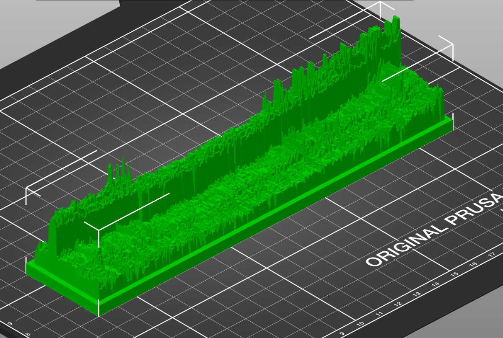

# agile2stl
Octopus Agile prices to 3D STL file

This is a little project, inspired by Greg Jackson of Octopus Energy who challenged the community to produce a 3D printed visualisation of historical Octopus Agile electricity tariff prices.



There are two Python 3 scripts here, one fetches the required pricing data from the Octopus APIs and writes it to a CSV formatted file. The other script reads this CSV pricing file and builds a 3D model, writing the output in STL format ready for slicing for a 3D printer.

For either script, the options '-h' or '--help' will show the command line options help.

## Fetching the Agile data

To fetch all of 2020's price data for MPAN region A:

```bash
python3 fetch_agile.py -y 2020 -r A agile_2020.txt
```

## Creating the STL file

To create the STL from the price data:

```bash
python3 agile2stl.py agile_2020.txt agile_2020.stl
```

Note that when you run this there will be an error shown, unfortunately that is from the STL library, but it appears harmless with current Python 3 versions.

## Dependancies

The agile2stl.py script requires the following Python libraries, which should be readily available with your Python distribution. The Ubuntu/Debian package names are given in brackets.

* numpy   (python3-numpy)
* numpy-stl   (python3-stl)
* matplotlib  (python3-matplotlib)
